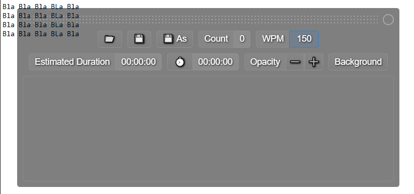

# Quick Teleprompter Thing (not technically as it doesn't scroll yet)

I was soooo tired of having notepad over my windows when recording and not being able to see behind it. So I made this in literally 10 minutes.

Now also has some basic tools (like word count, estimated duration based on wpm, opacity controls). They can be hidden with the little circle in the top right.

Might add auto-scrolling and nicer icons if I have some time in the future.

# Building

Requires node.js, then just `npm install` and `npm run make`.

# Notes

WPM is set to 170 because that's just a bit lower than what I read at when reading at medium speed to encourage me to make cuts.
